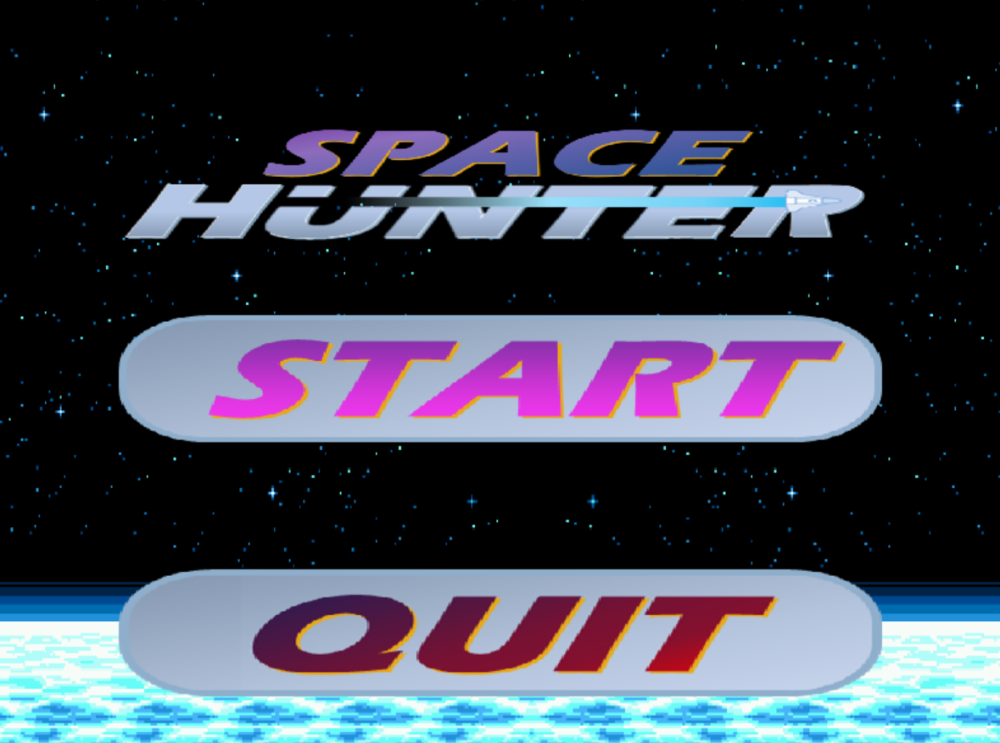
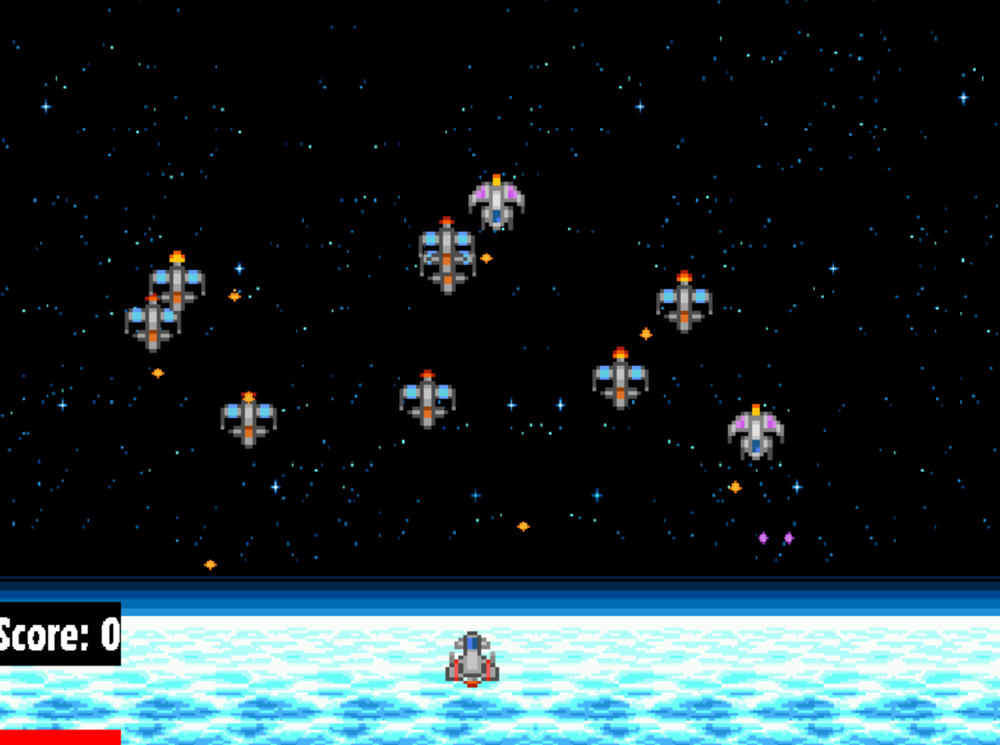

# SpaceHunter - C++ Project in SDL2
---
Bienvenue dans le projet SpaceHunter pour le cours "Programmation Orientée Objet en C++" pour le cours de Système Embarqués et Robotique
à l'ISEN Yncréa Méditerranée.

# Ressources utilisées pour le projet
- [CLion Template for SDL2 Projects (Base du Projet)](https://github.com/llanillo/clion-cmake-sdl2-template)
- [SDL2_image (2.8.2)](https://github.com/libsdl-org/SDL_image/releases)
- [SDL2_ttf (2.22.0)](https://github.com/libsdl-org/SDL_ttf/releases)
- [SDL2_mixer (2.8.0)](https://github.com/libsdl-org/SDL_mixer/releases)

# Visuel du jeu

Merci d'avoir lu ce README, et bon jeu ! 
Pour toutes questions, veuillez me contactez à l'adresse suivante : [logan.gairoard@gmail.com](mailto:logan.gairoard@gmail.com)